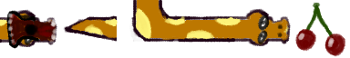
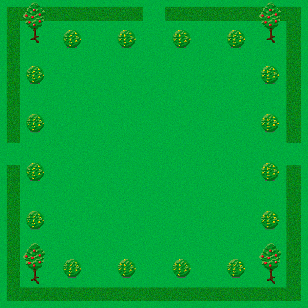
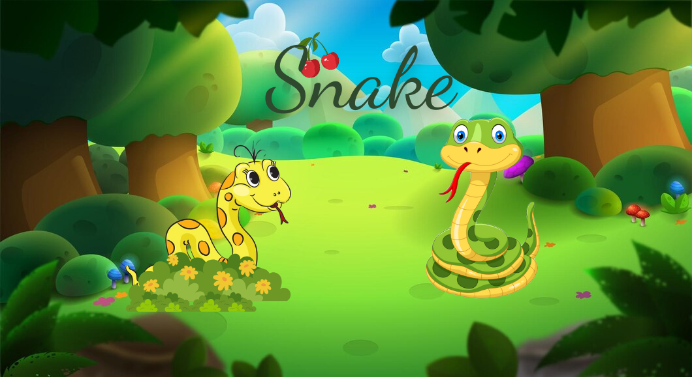
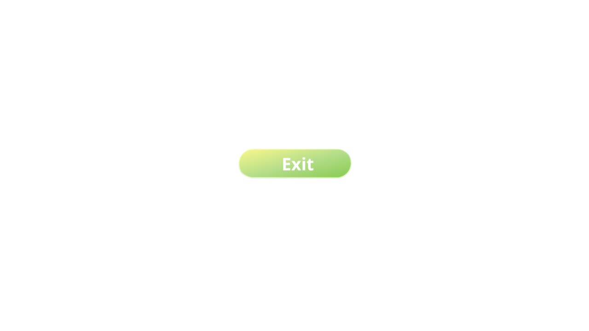

# Snake Game

## Introduction
- Họ và tên: Chẩu Khánh Ly - K68J - UET
- Mã số sinh viên: 23020682
- Bài tập lớn: Snake Game (INT2215_25 - Lập trình nâng cao)

## Demo Game
link:

## Description 
- Game Snake là một trò chơi arcade kinh điển trong đó người chơi điều khiển một con rắn trên một bảng chơi. Mục tiêu của trò chơi là điều khiển con rắn để ăn những quả trái cây xuất hiện trên bảng. Mỗi lần con rắn ăn được một quả trái cây, chiều dài của nó sẽ tăng lên, và trò chơi sẽ trở nên khó khăn hơn khi người chơi phải điều khiển một con rắn dài hơn.
Trong phiên bản này game rắn có một số tính năng đặc biệt:

- Di chuyển xuyên tường: Con rắn có thể di chuyển qua các bức tường của màn hình mà không gặp trở ngại. Khi rắn đi ra khỏi một cạnh của màn hình, nó sẽ xuất hiện ở cạnh đối diện, tạo ra trải nghiệm chơi game liên tục và thách thức.
- Tăng tốc độ khi ăn quả: Khi con rắn ăn một quả, tốc độ di chuyển của nó sẽ tăng lên. Điều này khiến trò chơi trở nên kịch tính hơn khi bạn phải nhanh chóng phản ứng và điều khiển con rắn một cách khéo léo để tránh tự ăn vào đuôi của mình.
- Mục tiêu của trò chơi: Mục tiêu của bạn là điều khiển con rắn ăn càng nhiều quả càng tốt để ghi điểm cao. Mỗi lần ăn một quả, con rắn sẽ dài ra và tốc độ của nó sẽ tăng lên, đòi hỏi bạn phải có kỹ năng phản xạ nhanh và lập kế hoạch di chuyển cẩn thận.
Trò chơi rắn mang lại trải nghiệm đơn giản nhưng thú vị, với khả năng thử thách người chơi ở mọi cấp độ kỹ năng. Hãy thử thách bản thân và xem bạn có thể khiến con rắn của bạn dài bao nhiêu nhé!

  
## 0.Cách tải game 
Tải file nén: Cách này tiết kiệm bộ nhớ và thời gian tải đi rất nhiều (khoảng 20.7MB).
+ Tải game (được nén thành .zip) tại link sau: https://github.com/Khanhlywan/snake/blob/main/Snake.zip, hoặc Chọn Code -> Download zipzip
+ Giải nén game vào một thư mục và bật Snake.exe lên và chơi.
Hoặc có thể Clone repo này về.

## 1. Bắt đầu game
Khi bật file Snake.exe, hiện lên menu của game sau đó ta click chuột vào "Play" để chơi game, "Exit" để thoát game.

Click "Play", game sẽ bắt đầu. Bạn sử dụng các nút mũi tên lên, xuống, trái, phải để điều khiển con rắn và cho con rắn ăn quả

Khi bạn điều khiển con rắn tự đâm vào thân mình thì nó sẽ chết và hiện lên cửa sổ có nút "Play Again", nếu bạn nhấn nút enter hoặc  click vào nút đó trò chơi sẽ được reset lại và bắt đầu chơi lại. Nếu bạn muốn thoát trò chơi, hãy click vào dấu "X" trên thanh công cụ để thoát game.

## 2. Đồ họa và âm thanh trong game
Trong game gồm con rắn và quả cherry được vẽ bằng GNU Image Manipulation, con rắn gồm các bộ phận đầu, thân, đuôi, và mở miệng khi ăn quả.
nguồn:https://github.com/mika314/snake/blob/master/sprites.bmp

Background của game

Menu và các nút "Play", "Exit", "Play Again" mình tự thiết kế

                     

Âm thanh: Lấy các âm thanh trên google
## 3. Source code
- **snake.h**
  -- Khai báo các thư viện cần dùng để chạy code
  -- Khai báo các hàm bên trong Class Snake
- **snake.cpp**
   -- Định nghĩa các hàm trong snake.h
   -- Hàm Snake để load lên các hình ảnh, âm thanh
   -- Hàm generateFruit tạo quả ngẫu nhiên và kiểm tra xem quả có trùng với rắn không.
   -- Hàm onFruitEaten để tăng tốc độ di chuyển của con rắn thông qua việc giảm thời gian giữa các lần di chuyển.
   -- Hàm ~Snake có nhiệm vụ giải phóng tài nguyên và đóng các thành phần sử dụng trong trò chơi rắn
   -- Hàm exe điều khiển quá trình chạy trò chơi rắn bằng cách xử lý sự kiện, cập nhật trạng thái và vẽ các phần tử trên màn hình, và sau đó giải phóng tài nguyên và đóng các thành phần khi trò chơi kết thúc.
   -- Hàm displayPlayAgainScreen được sử dụng để hiển thị màn hình "Play Again" và xử lý các sự kiện từ người chơi, bao gồm nhấn phím, nhấp chuột và yêu cầu thoát trò chơi.
   -- Hàm exitGame(): Hàm này được sử dụng để thoát khỏi trò chơi. Nó giải phóng các tài nguyên âm thanh, đóng kết cấu và cửa sổ, đóng SDL, và cuối cùng là thoát khỏi ứng dụng bằng cách gọi exit(0).
   -- Hàm resetGame(): Hàm này được sử dụng để thiết lập lại trạng thái của trò chơi khi người chơi muốn chơi lại. Nó xóa danh sách các đoạn của con rắn và khởi tạo lại các giá trị ban đầu như vị trí, hướng di chuyển và tốc độ. Sau đó, nó gọi phương thức exec() để bắt đầu chạy lại trò chơi.
   -- Hàm tick(): Hàm này được gọi mỗi khi di chuyển một bước trong trò chơi. Nó xác định thời điểm di chuyển cuối cùng và kiểm tra xem có va chạm với thân rắn hay không. Nếu có, trò chơi kết thúc. Sau đó, nó cập nhật vị trí của đoạn đầu của con rắn dựa trên hướng di chuyển hiện tại và kiểm tra xem con rắn đã ăn quả hay chưa. Nếu con rắn ăn quả, nó tạo một quả mới và tăng tốc độ của con rắn. Cuối cùng, nó trả về true nếu trò chơi vẫn tiếp tục và false nếu trò chơi kết thúc.
   -- Hàm draw(): Hàm này được sử dụng để vẽ các phần tử của trò chơi lên màn hình. Nó sử dụng các texture và renderer để vẽ hình ảnh và vị trí của các đoạn của con rắn. Ngoài ra, nó cũng vẽ quả trái cây trên màn hình. Cuối cùng, nó gọi SDL_RenderPresent(renderer) để hiển thị các phần tử đã được vẽ.
- **graphics.h**: lớp ultis và các phương thức trong đoạn mã trên được sử dụng để cung cấp các chức năng tiện ích cho việc làm việc với SDL, bao gồm khởi tạo và giải phóng tài nguyên, vẽ hình ảnh và xử lý sự kiện từ người dùng. **Mình sử dụng lớp ultis để tạo menu cho game**.
- **graphics.cpp**
   -- SDLInit(): Phương thức này được sử dụng để khởi tạo SDL và tạo cửa sổ và renderer cho ứng dụng. Nó sử dụng SDL_Init() để khởi tạo SDL, sau đó tạo cửa sổ với SDL_CreateWindow() và renderer với SDL_CreateRenderer(). Cuối cùng, nó thiết lập kích thước của renderer và chất lượng tỉ lệ render.
   -- close(): Phương thức này được sử dụng để giải phóng tài nguyên và đóng cửa sổ và renderer. Nó gọi SDL_DestroyWindow() và SDL_DestroyRenderer() để giải phóng cửa sổ và renderer, sau đó gọi SDL_Quit() để đóng SDL.
   -- waitkeypressed(): Phương thức này được sử dụng để chờ người dùng nhấn một phím bất kỳ trên bàn phím. Nó chạy trong một vòng lặp vô hạn và sử dụng SDL_WaitEvent() để chờ sự kiện từ người dùng. Nếu sự kiện là nhấn phím hoặc thoát ứng dụng, vòng lặp sẽ thoát.
   -- loadtexture(string path): Phương thức này được sử dụng để tải một texture từ tệp hình ảnh được chỉ định bởi path. Nó sử dụng IMG_LoadTexture() để tải texture từ renderer và trả về texture đã tải.
   -- inside(int &x,int &y,SDL_Rect rect): Phương thức này được sử dụng để kiểm tra xem một điểm (x, y) có nằm trong một hình chữ nhật rect hay không. Nó kiểm tra xem điểm có nằm trong phạm vi x và y của hình chữ nhật hay không và trả về true nếu điểm nằm trong và false nếu không.
   -- free(SDL_Texture* &texture): Phương thức này được sử dụng để giải phóng một texture đã được tải. Nó gọi SDL_DestroyTexture() để giải phóng texture và gán con trỏ texture thành nullptr.
   -- blitRect(SDL_Texture *texture, SDL_Rect *src, int x, int y): Phương thức này được sử dụng để vẽ một phần của texture lên renderer tại vị trí (x, y). Nó tạo ra một SDL_Rect mới để xác định vị trí và kích thước của texture trên renderer và sử dụng SDL_RenderCopy() để sao chép texture lên renderer.
   -- renderTexture(SDL_Texture *texture, int x, int y,int w,int h): Phương thức này được sử dụng để vẽ toàn bộ texture lên renderer tại vị trí (x, y) và kích thước (w, h). Nó sử dụng SDL_QueryTexture() để lấy kích thước của texture và sau đó sử dụng SDL_RenderCopy() để sao chép texture lên renderer.
toado(SDL_Texture *texture, int x, int y,int w,int h): Phương thức này được sử dụng để tạo một đối tượng SDL_Rect đại diện cho vị trí và kích thước của texture trên renderer. Nó sử dụng SDL_QueryTexture() để lấy kích thước của texture và sau đó trả về một SDL_Rect với vị trí và kích thước đã được chia cho w và h.
- **main.cpp**: Dùng để chạy trò chơi rắn.
## 4. Các nguồn tham khảo
link: https://www.youtube.com/watch?v=nK_sT12h22s&t=2969s
- Mình tham khảo code của game này và phát triển game để game có thêm nhiều tính năng hơn như là:
   -- Tạo thanh công cụ cho game
   -- Tạo menu và play again cho game
   -- Con rắn xuyên qua tường.
   -- Cải tiến các thao tác chơi, game ban đầu khi nhấn nhầm nút di chuyển sẽ out game luôn. Mình đã cải tiến để khi người chơi có lỡ ấn nhầm nút sẽ không out game luôn mà vẫn có thể tiếp tục chơi tiếp.
   -- Tốc độ của con rắn tăng lên khi nó ăn quả.
link: https://lazyfoo.net/tutorials/SDL/index.php
Mình sử dụng lazyfoo học cách lập trình game, từ những khái niệm cơ bản như cấu trúc game loop, xử lý sự kiện, vẽ đồ họa, âm thanh và nhiều hơn nữa.
## 5. Những kiến thức học được.
- Tìm hiểu về SDL 2.0:
  - SDL_TTF.
  - SDL_Mixer.
  - SDL_Image.
- Thiết kế ảnh.
- Cài đặt:
  - Menu.
  - Bắt đầu.
  - Cài đặt âm thanh.
  - Chơi lại.
- Cách tách file
- Sử lí sự kiện
- Tạo menu, thanh công cụ.
